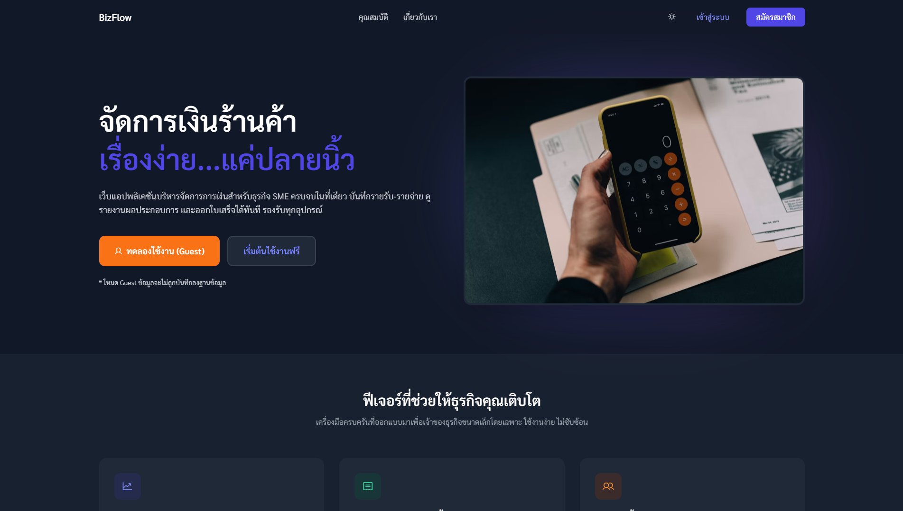

# BizFlow

BizFlow คือเว็บแอปพลิเคชันสำหรับบริหารจัดการการเงินส่วนบุคคลและการเงินธุรกิจขนาดเล็ก โดยออกแบบให้ใช้งานง่าย เข้าใจเร็ว และช่วยให้ผู้ใช้เห็นภาพรวมสถานะทางการเงินได้ชัดเจนในที่เดียว

## ภาพรวมระบบ
ระบบรองรับการใช้งานทั้งผู้ใช้ทั่วไปและผู้ใช้ที่ต้องการจัดการการเงินในลักษณะร้านค้า/ธุรกิจ โดยผู้ใช้สามารถบันทึกรายการทางการเงินรายวัน ติดตามสรุปผล และตรวจสอบข้อมูลย้อนหลังได้อย่างเป็นระบบ

## วัตถุประสงค์ของเว็บไซต์
- ช่วยให้ผู้ใช้บันทึกรายรับ-รายจ่ายได้สะดวกและรวดเร็ว
- ลดความซับซ้อนในการติดตามเงินเข้า-ออก
- สร้างความเข้าใจภาพรวมสถานะการเงินผ่านหน้าสรุปผล
- รองรับการใช้งานที่ยืดหยุ่นด้วยหมวดหมู่แบบกำหนดเอง

## ฟีเจอร์หลักของ BizFlow
1. ระบบผู้ใช้งาน
- สมัครสมาชิกและเข้าสู่ระบบ
- แยกข้อมูลตามบัญชีผู้ใช้
- รองรับโหมดผู้เยี่ยมชม (Guest) สำหรับทดลองใช้งาน

2. ระบบบันทึกธุรกรรม
- รองรับประเภทข้อมูล: รายรับ, รายจ่าย, ลูกหนี้, เจ้าหนี้
- บันทึกข้อมูลสำคัญ เช่น จำนวนเงิน รายการ วันที่ และหมวดหมู่
- แก้ไข/ลบรายการย้อนหลังได้

3. ระบบหมวดหมู่
- มีหมวดหมู่สำเร็จรูปหลายกลุ่มสำหรับการใช้งานทั่วไปและธุรกิจ
- เพิ่มความยืดหยุ่นด้วยตัวเลือก `อื่นๆ`
- เมื่อเลือก `อื่นๆ` ผู้ใช้สามารถระบุชื่อหมวดหมู่เองได้

4. หน้าสรุปและติดตามผล
- Dashboard แสดงภาพรวมทางการเงิน
- รายการธุรกรรมแบบกรองข้อมูลได้
- มุมมองปฏิทินเพื่อดูข้อมูลรายวัน
- สรุปข้อมูลลูกหนี้/เจ้าหนี้เพื่อวางแผนการชำระ

5. การจัดการข้อมูล
- Export ข้อมูลในรูปแบบไฟล์
- รองรับการจัดระเบียบข้อมูลเพื่อใช้งานต่อหรือจัดทำรายงาน

## โครงสร้างหน้าหลักของระบบ
- `Landing Page` สำหรับแนะนำระบบ
- `Dashboard` สำหรับดูภาพรวม
- `Transactions` สำหรับจัดการรายการทั้งหมด
- `Calendar` สำหรับดูธุรกรรมตามวัน
- `Debts` สำหรับติดตามลูกหนี้และเจ้าหนี้
- `Settings` สำหรับตั้งค่าการใช้งาน

## กลุ่มผู้ใช้งานเป้าหมาย
- บุคคลทั่วไปที่ต้องการคุมค่าใช้จ่ายส่วนตัว
- นักเรียน/นักศึกษาใช้บันทึกและวิเคราะห์การเงินรายวัน
- ผู้เริ่มต้นทำธุรกิจขนาดเล็กที่ต้องการเครื่องมือใช้งานง่าย

## เทคโนโลยีของโครงการ
- Frontend: HTML, Tailwind CSS, Vue 3
- Backend: Node.js + Express
- Database: MongoDB Atlas
- Deployment: Vercel

## จุดเด่นของโครงการ
- ใช้งานง่าย ไม่ซับซ้อน
- รองรับทั้งผู้ใช้ทั่วไปและเชิงธุรกิจ
- ปรับหมวดหมู่ได้ตามการใช้งานจริง
- มีทั้งมุมมองข้อมูลเชิงรายการและเชิงภาพรวม

โปรเจกต์นี้จัดทำขึ้นเพื่อการเรียนรู้ การพัฒนาเชิงปฏิบัติ และการนำเสนอผลงานด้านการพัฒนาเว็บแอปพลิเคชัน
